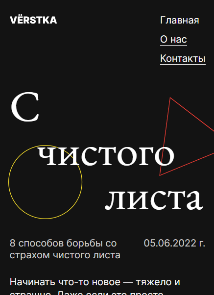

<h1>С чистого листа</h1>

<h2>Описание</h2>

Одностраничный сайт для смартфонов. Сверстан под ширину экрана в 360px. Посвящен теме борьбы со страхом перед началом нового дела. Перечислены основные причины появления такого страха и даны полезные советы, как не бояться сделать первый шаг.

Структура:

<ul>
  <li>шапка с логотипом и навигацией;</li>
  <li>четыре секции с содержательным контентом;</li>
  <li>подвал с копирайтом и ссылками на сторонние ресурсы.</li>
</ul>
P.S. пути перехода по ссылкам не прописаны.
<h2>Технологии</h2>
<ul>
  <li>HTML (семантическая верстка);</li>
  <li>CSS (flexbox);</li>
  <li>БЭМ.</li>
</ul>
<h2>Ссылка на макет</h2>
<a href="https://www.figma.com/file/r7xSiFnmuTieV6hY2hXSCP/%231-С-чистого-листа-(Copy)?node-id=0%3A1&mode=dev">Открыть</a>
<h2>Ссылка на проект</h2>
<a href="https://juliadik.github.io/s-chistogo-lista-main/index.html">Открыть</a>